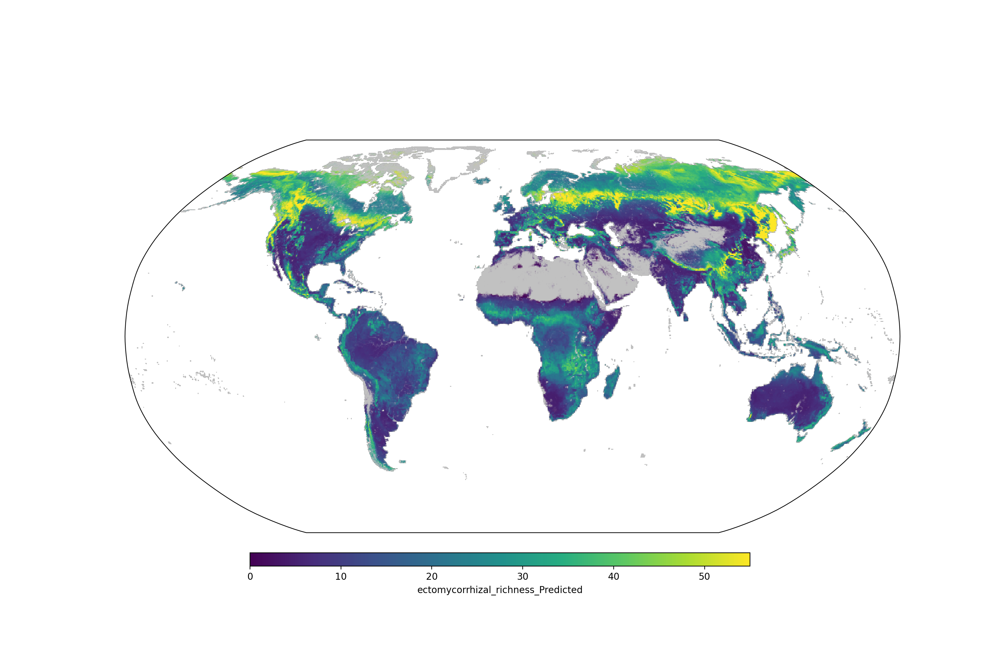

# SPUN Fungal Richness maps
This repository contains a versioned history of mycorrhizal richness predictions. 

# February 4th 2023: Global Fungi Release 4, EM only

## Version 1: GlobalFungi
- Date: 26 November 2021
- Source data: https://globalfungi.com/
- Maps: AMF, EMF; all taxa

## Version 2: Tedersoo
- Date: 26 November 2021
- Source data: https://link.springer.com/article/10.1007/s13225-021-00493-7
- Maps: AMF, EMF, Ericoid; all taxa
